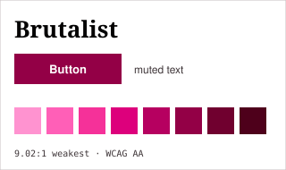
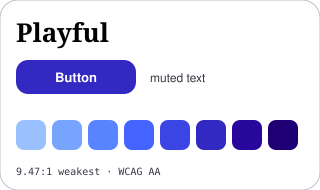
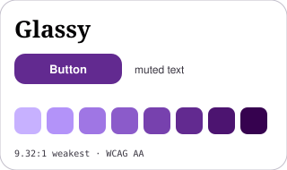
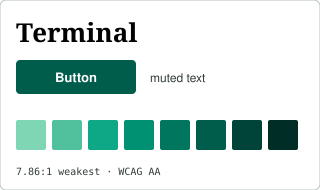
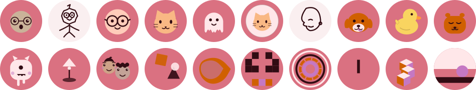

<p align="center">
  
</p>

<h1 align="center">notugly</h1>

<p align="center">
  <b>Designs that are provably not ugly.</b><br>
  Pick a vibe. Take the CSS. Nothing to install.
</p>

<p align="center">
  <a href="https://mohitagw15856.github.io/notugly"><b>▶ Try it</b></a> ·
  <a href="#avatars">Avatars</a> ·
  <a href="#take-it">Export</a> ·
  <a href="#why-provably">Why "provably"</a>
</p>

<p align="center">
  
  
  
  <a href="https://www.npmjs.com/package/notugly"></a>
</p>

```console
npx notugly
```

---

## Every design tool gives you things. This one gives you proof.

Generate a whole design system from a seed — colour, type, spacing, shadow,
motion, texture — and **every text pairing is checked against WCAG before you
ever see it.** Not audited afterwards. Generated that way.

```console
$ npx notugly audit

  ✓ body text on background        20.54:1  needs 4.5  AAA
  ✓ muted text on background       11.85:1  needs 4.5  AAA
  ✓ button label on button          8.16:1  needs 4.5  AAA
  ✓ focus ring on background        9.14:1  needs 3    pass

  Provably not ugly.
```

**2,000 out of 2,000** randomly sampled systems pass. That number is regenerated
on every build — if it ever drops, the build fails.

---

## Pick a vibe

<p align="center">
  
  
  
</p>
<p align="center">
  
  
</p>

Five complete opinions. Each one fixes the decisions that have to agree with
each other — radius, shadow, chroma, type, motion — because that's what makes a
design feel coherent rather than assembled by committee.

```console
npx notugly --vibe brutalist
```

**[On the website, the entire page becomes the vibe you pick.](https://mohitagw15856.github.io/notugly)**
That's the demo.

---

<h2 id="avatars">Avatars 🙂</h2>

<p align="center">
  
</p>

One name, eight styles. Deterministic — `mo` always gets the same face, forever.

```console
npx notugly avatar mo --style face --out mo.svg
```

**The bit other avatar libraries skip:** an avatar is a coloured disc sitting on
*your* background. If those two are close in luminance, the edge dissolves. Tell
notugly what it's sitting on and it fixes that:

```console
npx notugly avatar mo --on "#0b0d12"
```

---

<h2 id="take-it">Take it</h2>

Six formats. **The byte count is next to each one**, because nobody else will
tell you.

```console
$ npx notugly export --out ./ui

  notugly.css              2.9 kB
  tailwind.config.js       3.7 kB
  tokens.json              5.0 kB
  notugly.jsx              960 B
  Notugly.svelte           883 B
  index.html               4.4 kB

  runtime cost  0 bytes — static text, no dependency, nothing to install
```

Design tokens are plain CSS variables. The Tailwind config is a real config. The
JSON is [W3C design-token](https://tr.designtokens.org/) shaped, so it goes
straight into Style Dictionary or Figma.

---

## Steal a palette

```console
$ npx notugly steal lichess.org

  Colours  most used first
  #000000  ×55
  #f0d9b5  ×2
  #946f51  ×2
```

*(Those last two are the chessboard squares.)*

Point it at any site and get its palette, type stack, radii and scale back as
something you can edit. It's a heuristic — it reads the CSS it can see — and
it's a much better starting point than a blank slider.

---

## The chaos test

Design systems get demoed with three words of Latin and a square photograph.
**Real content is a 47-character German compound noun, a name in Arabic, an
image that 404s, and someone at 200% zoom.**

```console
npx notugly chaos
```

The [website runs every case live](https://mohitagw15856.github.io/notugly/#chaos)
against whatever you've generated. Most kits shatter. This one advertises that
it doesn't.

---

<h2 id="why-provably">Why "provably"</h2>

Because the claim is checkable, and the check is in the repo.

- **Colour maths in OKLab, not HSL.** In HSL, `#ffff00` and `#0000ff` are both
  "50% lightness" and one is nine times brighter. That's why most generated
  ramps look cheap.
- **Text colour is derived from its background**, not picked and hoped for. If
  no candidate clears the threshold, one gets built that does.
- **Motion ships with `prefers-reduced-motion`** in the same file. Animation
  without an escape hatch is a bug.
- **No webfonts.** A system that costs 300 kB before it renders is a liability.
- **Nothing is copied.** Every colour, shape and face is generated from a seed.

---

## Use it as a library

```js
import { system, audit } from 'notugly';
import { avatar } from 'notugly/avatar';

const ui = system('my-app', { vibe: 'playful', dark: true });
audit(ui).passed;              // true, or it's a bug
avatar('mo', { on: ui.colour.bg });
```

Everything is deterministic. Same seed, same design, forever — which is what
makes a design shareable as a URL and stable for a user's face.

---

<p align="center">
  <sub>MIT · zero dependencies · <a href="https://mohitagw15856.github.io/notugly">mohitagw15856.github.io/notugly</a></sub>
</p>
