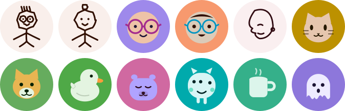
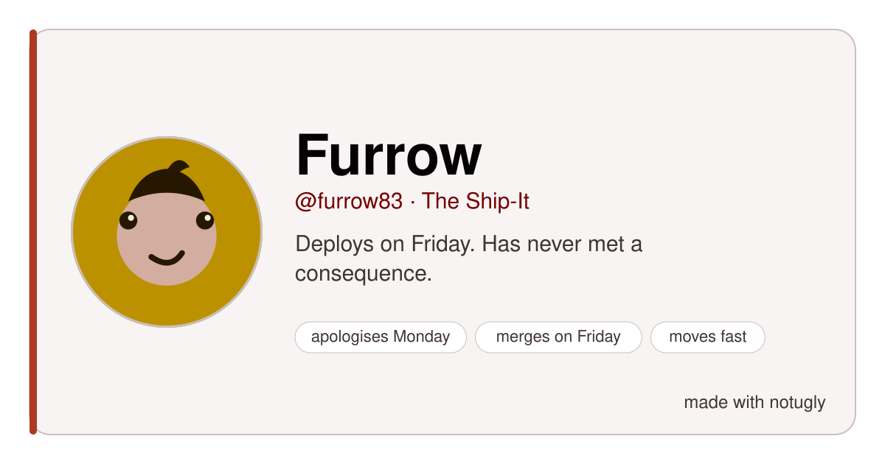

<p align="center">
  
</p>

<h1 align="center">notugly</h1>

<p align="center"><b>Your design is ugly. Here, have this one instead.</b></p>

<p align="center">
  <code>npx notugly</code>
</p>

<p align="center">
  <a href="https://mohitagw15856.github.io/notugly"><b>Play with it →</b></a>
</p>

<br>

## What is this

You need colours. You pick a blue. You pick a grey that goes with the blue.
Twenty minutes later you have eleven greys, none of them go together, and the
button text is unreadable but you've stopped being able to tell.

This does that bit for you, and **it can't produce an unreadable pairing** —
not because it checks afterwards and apologises, but because the text colour is
worked out *from* the background. There's no code path that produces bad
contrast. Try to find one.

```console
$ npx notugly audit

  ✓ body text on background        20.55:1  needs 4.5  AAA
  ✓ muted text on background       11.86:1  needs 4.5  AAA
  ✓ button label on button             8:1  needs 4.5  AAA

  Provably not ugly.
```

2,000 random systems, 2,000 passes. The build regenerates that number every
time and **fails if it slips**, which is a very stressful way to write a README
claim.

<br>

## Meet the tiny man who lives here

<p align="center">
  
</p>

He's on the website. His eyes follow your cursor, he re-skins himself in
whatever design you're currently looking at, he gets alarmed when you reroll,
and if you leave him alone for twenty-five seconds he falls asleep.

He is also, unavoidably, judging your contrast ratios.

<br>

## Twenty faces

<p align="center">
  
</p>

```console
npx notugly avatar mo --style pencil
```

**Pencil people** whose lines genuinely wobble — every segment's midpoint gets
jittered, so they look drawn rather than computed. **Specs**, a small round
character whose entire personality is its glasses. A **capybara**, because of
course. **Desk objects** for team pages where a face feels presumptuous. And
**one-line portraits**, traced without lifting the pen.

<details>
<summary><b>All twenty, plus the thing every other avatar library gets wrong</b></summary>

<br>

<p align="center">
  
</p>

An avatar is a coloured disc sitting on *your* page background. If those two
happen to be close in luminance, the edge dissolves and you get a floating
face. Nobody checks for this. It looks broken and nobody knows why.

Tell notugly what it's sitting on and it adds a separating ring — but only when
it actually needs one:

```console
npx notugly avatar mo --on "#0b0d12"
```

</details>

<br>

## Same person, different day

<p align="center">
  
</p>

Six moods and seven hats, and **the person underneath never changes**. Same
hair, same glasses, same face — just a different afternoon.

That sounds easy and isn't: a mood has to pull from the random stream even when
it's about to overrule the value, or every later draw shifts and you get a
different human being wearing the same name.

```console
npx notugly avatar mo --mood determined --hat crown
```

<br>

## A face is not a presence

<p align="center">
  
</p>

A presence is a face **and** a name **and** a way of talking **and** a colour
that's yours. Those four agreeing is what makes something feel like *somebody*
rather than an asset. So all of it comes out of one seed:

```console
$ npx notugly persona mo

  Otter Spare @otter.spare
  The Night Owl  ·  unreachable at 10am · peaks at 1am · best work in the dark

  Does the best work between midnight and four. Do not schedule the standup.
  "ok NOW bed"

  colour     #0084b5
  face       cat, feeling sleepy
  energy     ▮▮▮▮▯
```

Twelve archetypes — the Lurker, the Overthinker, the Ship-It, the Chaos Goblin,
the one who says "source?" — and each one picks its own face, its own colour
family and its own typographic vibe. The Archivist gets a serif and a filing
cabinet. The Menace gets hot pink and a monster.

```console
npx notugly persona mo --out ./me      # avatars, favicon, social card, CSS
npx notugly cast ada grace linus       # a team, guaranteed no two alike
```

That social card up there is 1200×630 — the size every platform crops to — and
it has **no webfonts, no images and nothing that can 404** in someone else's
preview crawler. It's one SVG that contains itself.

> Nothing here calls a model. Every name, bio and catchphrase was written by a
> person and is picked by a seeded PRNG, so it runs offline, costs nothing, and
> gives the same answer forever.

<br>

## The bit where it judges you

```console
$ npx notugly roast "#ffffff" "#f8f8f8" "#00ffcc" "#ff00ff" "#ffff00"

  Spectacularly ugly. Genuinely impressive.  0/100

  ✗ #f8f8f8 on #ffffff is 1.06:1. You need 4.5. That is not a colour,
    that is a rumour of a colour.
    → #767676 would clear it, and it is still the same hue.

  ! #00ffcc and #ffff00 are the same colour to anyone with protanopia —
    ~1% of men. If one of those means "error", that is a real bug.

  · 3 of these do not exist in CMYK. Fine on screen, a disappointment
    on a business card.
```

Every line is earned from a measurement. There are no generic burns, and the
tests enforce that — each finding has to arrive with its evidence attached.

<br>

## Four things nobody else checks

<table>
<tr><td width="180">

**Fix a pairing**

`notugly fix`

</td><td>

You have two colours, they fail, and you don't want a new palette — you want
the nearest colour to the one you already picked. `#8ab4f8` → `#4f76b6`. Same
hue, same chroma, now readable. It searches both directions, because the
obvious way is wrong more often than you'd think.

</td></tr>
<tr><td>

**Colour blindness**

`notugly vision`

</td><td>

Real cone-response matrices — Viénot, Brettel & Mollon — not the sepia-and-hue-rotate
filter chain everyone ships. A filter moves colours roughly the right way and
gets the *actual confusions* wrong, which is the only part that matters.

</td></tr>
<tr><td>

**APCA**

</td><td>

WCAG 2's ratio is symmetric: it claims dark-on-light and light-on-dark are
equally readable. They aren't. Both numbers are reported; only WCAG can fail
the build, because that's the one you get sued over.

</td></tr>
<tr><td>

**Print**

`notugly print`

</td><td>

Electric cyan does not exist in CMYK. It comes off the press muddy and someone
blames the printer. The gamut is modelled from the actual process-ink
primaries, so it can tell you what your colour becomes on paper.

</td></tr>
</table>

<br>

## Taking it into a room

Everything above makes a design. This makes the **documents about** a design —
a different job, for the people who have to explain it, print it, or defend it.

```console
$ npx notugly diff stripe.com linear.app

                    stripe.com        linear.app
  Colours           16                16               —
  Greys             4                 7                stripe.com by 3
  Typefaces         5                 1                linear.app by 4
  Type sizes        10                8                linear.app by 2
  Corner radii      5                 5                —
  Unreadable pairs  5                 12               stripe.com by 7

  Type scale consistent: stripe.com yes · linear.app no
```

That's a real run, not an illustration. It replaces "theirs feels more premium"
with sentences nobody can argue with — and note that neither site wins
everything, which is usually the honest answer.

It does not tell you which is *better*. That is not a thing a program knows.

> It reads the stylesheets it can fetch, so it sees what a browser sees on first
> load and not what JavaScript adds later. A partial sample, honestly labelled,
> beats a confident guess.

| | |
|---|---|
| `notugly spec <url>` | What that design is made of, as a table you can paste into a doc. |
| `notugly onepager` | One printable sheet: what fails, and whether each fix is a find-and-replace or a decision somebody has to sign off. |
| `notugly cost <url>` | Kilobytes of webfont and hours of work. Counts measured, hours estimated — and it says which is which. |
| `notugly slides` | A real `.thmx` for PowerPoint and Keynote, plus a Google Slides guide. |
| `notugly watch <url>` | What changed since last time. |

**A decision log.** The website records every reroll and vibe change and exports
it as *"here is why it looks like this"*. Six months later somebody will ask.

**Present mode.** Hides every control so nobody leans over and rerolls your work
mid-meeting. `S`, or the button.

<br>

## The deck theme is the one nobody else ships

PowerPoint hands `accent1`–`accent6` to chart series in order, so **every** pair
has to be distinguishable — not just neighbours. Hue is not enough: a
colour-blind viewer loses hue and a greyscale printout loses it entirely.

So the six are a lightness ladder with the hue rotating underneath. Different in
colour for most people, different in tone for everyone. There's a test that
fails the build if any pair in any vibe drops below 1.2:1.

<br>

## Things you print

```console
npx notugly poster --out wall.svg      # A3, gamut-checked
npx notugly specimen --out type.svg    # a proper specimen sheet
npx notugly zine --out fold.svg        # 8 pages, one sheet, one cut
```

True-size SVG in millimetres, with every colour pulled into the CMYK gamut
first — so what you pin up is what came out of the printer.

The zine imposition is the fiddly bit: fold a sheet into eighths and the pages
do not land in reading order, and half of them are upside down. The layout is
the real one, with the cut line marked.

<br>

## From a picture

Drop in a photograph, a screenshot, or four images for a mood board, and get the
system they imply.

It is pixel arithmetic — deterministic k-means in OKLab. **Nothing is uploaded
and no model is called**, which also means the same image always gives the same
palette. A palette that changes every time you press the button is not a
palette, it's a slot machine.

<details>
<summary><b>The bug that made this worth writing up</b></summary>

<br>

Merging near-identical colours by **contrast ratio** seems obviously right and is
completely wrong. Contrast is luminance only, and a sunset orange and a teal sit
within 1.1:1 of each other — so a contrast-based merge silently ate the accent
colour and handed back a palette of browns.

It asks OKLab how different they *look* now. There's a test.

</details>

<br>

## Colour names

```console
$ npx notugly name "#4f76b6" "#e4002b" "#8a8577"

  #4f76b6   Hydrangea    close match
  #e4002b   Cherry       nearest
  #8a8577   Mushroom     close match
```

Nobody has ever said "can we make it a bit less `#4f76b6`". You can argue about
Hydrangea. Names are unique within a palette, and it tells you when a name is a
stretch rather than pretending.

<br>

## Four decades

```console
npx notugly eras
```

The same seed as 1998, 2008, 2015 and now — bevels, then gloss, then flat, then
whatever we're doing. Every one of them was, at the time, what modern looked
like. So is the last one.

Contrast is still enforced in every era. The period joke does not get to ship an
unreadable artefact.

<br>

## Keeping it

```yaml
- uses: mohitagw15856/notugly@main
  with:
    url: ${{ steps.deploy.outputs.url }}
    baseline: design-baseline.json
```

Design systems fail one exception at a time — a slightly different grey for a
banner, a one-off radius on a modal. Individually every one is reasonable.
Eighteen months later nobody can tell you what the brand colour is.

`notugly watch` commits a baseline next to your code and tells you what drifted,
distinguishing *"a new colour"* from *"a colour 0.003 away from one you already
had, because somebody could not find the token"*.

`notugly tokens` reads the other direction — point it at a W3C token file or a
Figma variables export and it names the failing pairs: `color.text.danger on
surface.default is 2.99:1 — needs 4.5`.

<br>

## Bring your own brand

The commonest and most reasonable objection to any generator is *"this is lovely
but our colour is #E4002B and that is not negotiable"*. Fine:

```console
npx notugly --brand "#e4002b"
```

Your colour, used exactly as given. Everything else — the accent, the neutral
tint, the ramps, the button label — is built around it, and **the audit still
passes**. Eighty brand-locked combinations are checked on every commit.

<br>

## Five opinions

<p align="center">
  
  
  
</p>
<p align="center">
  
  
</p>

Radius, shadow, saturation, type and motion all have to agree with each other
or the thing looks like four people built it. So they're decided together.

**[On the website the whole page turns into the vibe you click.](https://mohitagw15856.github.io/notugly)**
That's not a demo panel. That's the actual page.

<br>

## Then you take it

```console
$ npx notugly export --out ./ui

  notugly.css                              2.7 kB
  tailwind.config.js                       3.5 kB
  tokens.json                              4.9 kB
  notugly.jsx                               710 B
  Notugly.svelte                            632 B
  index.html                               4.0 kB
  figma/manifest.json                       162 B
  figma/code.js                            3.8 kB
  vscode/package.json                       395 B
  vscode/themes/notugly-color-theme.json   3.3 kB

  runtime cost  0 bytes
```

That last line is the point. It's all static text. No package, no provider, no
`<ThemeProvider>` wrapping your entire app, nothing to `npm install` at 3am
when it breaks.

The Figma one is a **loadable plugin**, not a token file you then have to find
an importer for. The VS Code theme exists mostly because an editor is the
densest possible test of a palette — and every syntax colour in every vibe, in
both modes, clears 4.5:1 against its own background. There's a test for it.

<br>

## Also it steals

```console
$ npx notugly steal lichess.org

  #000000  ×55
  #f0d9b5  ×2
  #946f51  ×2
```

Those last two are the chessboard squares. It read them straight off the site.

<br>

## The chaos test

Every design system gets demoed with three words of Latin and a square
photograph.

Real content is `Rindfleischetikettierungsüberwachungsaufgabenübertragungsgesetz`,
a name in Arabic, an image that 404s, and someone at 200% zoom.

```console
npx notugly chaos
```

The [site throws all of it at whatever you've made](https://mohitagw15856.github.io/notugly/#chaos).
Most kits fall over. This one is quite smug about not doing that.

<br>

## Why it isn't just vibes

<table>
<tr><td width="180">

**Colour maths in OKLab**

</td><td>

In HSL, `#ffff00` and `#0000ff` are both "50% lightness". One is nine times
brighter than the other. That's why generated ramps usually look cheap.

</td></tr>
<tr><td>

**Motion ships its own off switch**

</td><td>

Every preset comes with `prefers-reduced-motion` in the same file. Animation
without an escape hatch is a bug, not a flourish.

</td></tr>
<tr><td>

**No webfonts**

</td><td>

300 kB before anything renders isn't a design system, it's a tax.

</td></tr>
<tr><td>

**Nothing is copied**

</td><td>

Every colour, shape, face and name is generated from a seed. No scraped assets,
no lifted palettes, no model calls.

</td></tr>
</table>

<br>

## As a library

```js
import { system, audit } from 'notugly';
import { avatar } from 'notugly/avatar';
import { persona, card } from 'notugly/persona';
import { fixContrast } from 'notugly/fix';
import { name } from 'notugly/names';
import { paletteFromImage } from 'notugly/quantise';

const ui = system('my-app', { vibe: 'playful', brand: '#e4002b' });
audit(ui).passed;                       // true. if it's false, that's my bug

avatar('mo', { on: ui.colour.bg,        // never invisible
               mood: 'determined' });

card(persona('mo'));                    // a 1200×630 social card, self-contained
fixContrast('#8ab4f8', '#ffffff');      // → #4f76b6, same hue, now readable
name('#4f76b6').name;                   // 'Hydrangea'
paletteFromImage(imageData);            // pixel maths, no upload, no model
```

Same seed, same design, forever. Which means a design is a URL you can send
someone, and a user's face never changes because a server restarted.

<br>

## Used by

The design skills in
**[pm-claude-skills](https://github.com/mohitagw15856/pm-claude-skills)** call
this for their contrast numbers — `accessibility-audit`, `design-system-audit`,
`design-handoff-brief`, `brand-guidelines` and the Figma reviews. Its MCP server
exposes `check_contrast` as a tool.

That's the argument for the whole library in one line: **a skill can tell a
model to check the contrast, but only arithmetic can actually check it.**

<br>

<p align="center">
  <sub>
    MIT · no dependencies · <a href="https://mohitagw15856.github.io/notugly">the fun version of this page</a>
  </sub>
</p>
